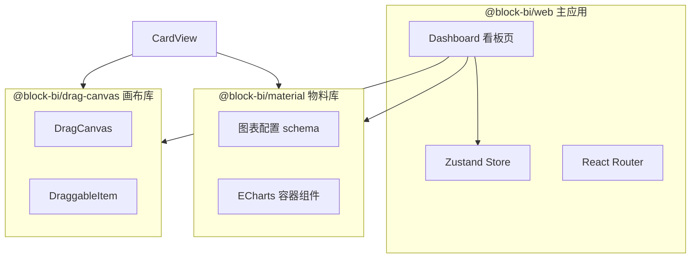
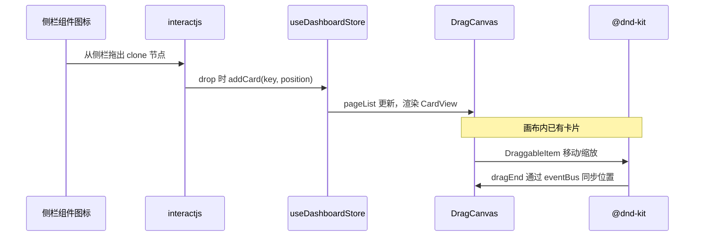

# BlocksBI 代码结构解读

## 1. 项目概述

**BlocksBI** 是一个基于 **Nx Monorepo** 的可视化 BI 看板搭建平台。用户通过左侧组件面板将图表拖入画布，在画布上自由布局、缩放与选中，最终形成可配置的数据看板。

### 技术栈

| 类别 | 技术 |
|------|------|
| 工程化 | Nx 20、pnpm workspace、Vite 6 |
| 前端框架 | React 18、TypeScript 5.7 |
| UI | Ant Design 5、Tailwind CSS 3 |
| 图表 | ECharts 5 |
| 状态管理 | Zustand 5 |
| 拖拽 | @dnd-kit/core（画布内）、interactjs（侧栏到画布） |
| 路由 | react-router 7 |

### 启动方式

```bash
pnpm install
pnpm start          # 等价于 npx nx serve web
npx nx build web    # 生产构建
```

---

## 2. 仓库目录结构

```
blocksBI/
├── doc/                          # 项目文档（本目录）
├── packages/                     # Monorepo 子包
│   ├── web/                      # 主应用：看板编辑器
│   ├── material/                 # 图表物料库：配置 + 渲染组件
│   └── drag-canvas/              # 可拖拽画布库
├── package.json                  # 根依赖与脚本
├── pnpm-workspace.yaml           # pnpm 工作区配置
├── nx.json                       # Nx 任务与插件配置
├── tsconfig.base.json            # 全局 TS 路径别名
├── jest.config.ts / vitest.workspace.ts
└── README.md
```

### 路径别名

`tsconfig.base.json` 中定义：

```json
"@block-bi/*": ["packages/*/src/index.ts"]
```

因此 `@block-bi/material`、`@block-bi/drag-canvas` 等可直接引用对应包的入口文件。

---

## 3. 三大子包职责



| 包名 | NPM 名称 | 职责 |
|------|----------|------|
| `web` | `@block-bi/web` | 看板 UI、路由、全局状态、拖拽编排 |
| `material` | `@block-bi/material` | 图表类型定义、样式/数据配置 schema、ECharts 封装 |
| `drag-canvas` | `@block-bi/drag-canvas` | 画布级拖拽、多选、吸附、边界限制 |

---

## 4. 主应用 `packages/web`

### 4.1 入口与路由

```
src/
├── main.tsx              # React 挂载入口
├── app/app.tsx           # 根组件，包裹 BrowserRouter
├── router/
│   ├── index.tsx         # useRoutes 容器
│   └── config.tsx        # 路由表
└── store/
    └── useDashboardStore.ts   # 看板全局状态
```

| 路径 | 页面 | 说明 |
|------|------|------|
| `/` | `pages/dashboard` | 主看板编辑器（默认页） |
| `/dndKit` | `pages/dndKit` | dnd-kit 相关实验页 |

### 4.2 Dashboard 页面布局

Dashboard 采用 Ant Design `Layout` 经典三栏结构：

```
┌─────────────────────────────────────────────────────────┐
│  Header (BiHeader) — 看板标题等                          │
├──────────┬──────────────────────────────┬───────────────┤
│ BiSider  │  BiContent (画布区)           │ 右侧 Sider    │
│ 260px    │  - CanvasContainer           │ 300px (占位)  │
│          │  - ViewFooter                │               │
│ 组件/图层│                              │               │
│ /布局 Tab│                              │               │
└──────────┴──────────────────────────────┴───────────────┘
```

**关键文件：**

| 文件 | 作用 |
|------|------|
| `pages/dashboard/index.tsx` | 页面骨架，组合 Header / Sider / Content |
| `pages/dashboard/header/index.tsx` | 顶部栏 |
| `pages/dashboard/sider/index.tsx` | 左侧 Tab：组件、图层、布局 |
| `pages/dashboard/sider/viewContainer/index.tsx` | 「组件」面板：按分组展示可拖拽图表图标 |
| `pages/dashboard/sider/search/index.tsx` | 组件搜索过滤 |
| `pages/dashboard/content/index.tsx` | 中间画布容器 + 底部 ViewFooter |
| `pages/dashboard/content/canvasContainer/index.tsx` | 集成 DragCanvas，渲染当前页所有卡片 |
| `pages/dashboard/content/canvasContainer/cardView.tsx` | 单张卡片：DraggableItem + 图表组件 |
| `pages/dashboard/hook/useIconDrag.ts` | 侧栏图标 → 画布的 interactjs 拖放逻辑 |
| `pages/dashboard/constants.ts` | 画布父级 ID、默认卡片尺寸等常量 |

### 4.3 状态模型（Zustand）

`useDashboardStore` 是看板的核心数据中心：

| 状态字段 | 类型 | 含义 |
|----------|------|------|
| `dashboardName` | `string` | 看板标题 |
| `pageList` | `CardLayout[][]` | 多页画布，每页为卡片布局数组 |
| `currentPageIndex` | `number` | 当前编辑页索引 |
| `cardMap` | `Record<id, CardItem>` | 卡片 ID → 完整配置（含 props） |
| `canvasWidth` / `canvasHeight` | `number` | 画布尺寸 |
| `currentEditingCardId` | `string` | 当前选中编辑的卡片 |
| `cardSearchName` | `string` | 侧栏组件搜索关键词 |

**核心 action：`addCard(cardKey, position)`**

1. 根据 `cardKey` 从 `@block-bi/material` 的 `configMap` 取默认配置；
2. 生成 `nanoid` 作为卡片 ID；
3. 用 `restrictToBounds`（来自 drag-canvas）将坐标限制在画布内；
4. 写入 `pageList[currentPageIndex]` 与 `cardMap`。

类型定义见 `src/types/dashboard.d.ts`。

### 4.4 拖拽数据流

项目中存在 **两套拖拽机制**，分工明确：



1. **侧栏 → 画布（新增卡片）**：`useIconDrag` + `interactjs`，监听 `.component-icon-item` 的 draggable，在画布区域 drop 时调用 `addCard`。
2. **画布内（移动/选中/多选）**：`@block-bi/drag-canvas` 基于 `@dnd-kit/core`，`DraggableItem` 包裹每个 `CardView`。

---

## 5. 物料库 `packages/material`

物料库负责 **「图表是什么」** 以及 **「如何配置」**，不负责页面布局。

### 5.1 目录结构

```
packages/material/src/
├── index.ts                 # 统一导出
├── constants.ts             # CARD_KEYS、COMPONENT_NAME 枚举
├── component.ts             # componentMap：componentName → React 组件
├── config/
│   └── index.ts             # configMap、siderConfig、leftMenuConfig
├── line/ bar/ pie/ scatter/ barLineMixed/
│   └── config.ts            # 各图表类型的完整配置定义
├── common/
│   ├── chartContainer.tsx   # ECharts 响应式容器
│   └── config/              # 可复用的配置片段（标题、坐标轴、图例等）
├── utils/index.ts           # getInitConfig、updateConfig
├── types/chart.d.ts         # IChartConfig 等类型
└── demoData/                # 演示数据
```

### 5.2 单种图表的配置结构

以 `line/config.ts` 为例，每种图表 export 一个 `config` 对象：

```ts
{
  siderConfig: { key, name, groupName, icon, componentName, ... },  // 侧栏展示
  styleConfig: [...],   // 样式面板 schema（由 common/config 拼装）
  dataConfig: {},       // 数据绑定（待扩展）
  eventConfig: {},      // 事件（待扩展）
}
```

- **`siderConfig`**：驱动左侧组件面板的分组与图标（`leftMenuConfig` 由 `lodash/groupBy` 按 `groupName` 生成）。
- **`styleConfig`**：描述右侧属性面板的表单项（key、defaultValue、组件类型等），通过 `getInitConfig` 转为嵌套对象供 ECharts `option` 使用。

### 5.3 已支持的图表类型

| CARD_KEYS | 目录 | 侧栏分组 |
|-----------|------|----------|
| `line` | `line/config.ts` | 常用图表 |
| `bar` | `bar/config.ts` | 常用图表 |
| `pie` | `pie/config.ts` | 常用图表 |
| `scatter` | `scatter/config.ts` | 常用图表 |
| `bar-line-mixed` | `barLineMixed/config.ts` | 常用图表 |

`constants.ts` 中还定义了更多 `CARD_KEYS`（如 scatter 组合类），部分尚未在 `config/index.ts` 的 `configMap` 中注册。

### 5.4 渲染组件

- `componentMap` 目前仅映射 `chart` → `common/chartContainer.tsx`。
- `chartContainer` 使用 ECharts + `ResizeObserver` 实现自适应尺寸。
- `CardView` 中通过 `getInitConfig(cardConfig.props.styleConfig)` 将 schema 转为 option（当前仍混有硬编码 demo option，属开发中状态）。

### 5.5 配置片段复用

`common/config/` 按功能拆分：

- `title.ts` — 标题
- `axis/` — 坐标轴名称、样式、图例、tooltip、series 等

新增图表时主要复用这些 builder（如 `getTitleConfig()`、`getSeriesConfig(CARD_KEYS.LINE)`），保持属性面板一致。

---

## 6. 画布库 `packages/drag-canvas`

独立 npm 包，可在其他项目中复用「可拖拽、可选中、可吸附」的画布能力。

### 6.1 核心模块

```
packages/drag-canvas/src/lib/
├── drag-canvas.tsx        # 画布根：DndContext + 多选/框选
├── draggableItem.tsx      # 可拖拽、可缩放的子项
├── canvasContext.ts       # useReducer 管理选中 ID、画布尺寸
├── selectCanvas/          # 框选区域
├── snapCanvas/            # 吸附对齐
├── utils/
│   ├── index.ts           # restrictToBounds、getSelectedAreaByDomIds 等
│   └── eventBus.ts        # 拖拽结束事件总线
├── IDrag.ts               # 类型定义
└── constants.ts
```

### 6.2 对外 API

```ts
// 默认导出
import DragCanvas from '@block-bi/drag-canvas'

// 命名导出
import { DraggableItem } from '@block-bi/drag-canvas'
import { restrictToBounds, getSelectedAreaByDomIds, ... } from '@block-bi/drag-canvas'
```

**DragCanvas 主要 props：**

| Prop | 说明 |
|------|------|
| `width` / `height` | 画布逻辑尺寸 |
| `canvasParentId` | 滚动容器的 DOM id（用于坐标换算） |
| `canvasRef` | 画布 DOM ref |
| `children` | 多个 `DraggableItem` |

**特性摘要：**

- `PointerSensor` 带延迟与容差，区分点击与拖拽；
- 支持多选、组合选中区域计算；
- `dragEnd` 通过 `eventBus` 按 `id-dragEnd` 分发 delta；
- `restrictToParentElement` 限制在父元素内拖动。

---

## 7. 模块依赖关系

```
                    ┌─────────────┐
                    │   web app   │
                    └──────┬──────┘
           ┌───────────────┼───────────────┐
           ▼               ▼               ▼
   ┌──────────────┐ ┌──────────────┐ ┌─────────────┐
   │ drag-canvas  │ │   material   │ │ antd/zustand│
   └──────────────┘ └──────────────┘ │ echarts/... │
           │               │         └─────────────┘
           │               │
           ▼               ▼
      @dnd-kit/core    echarts + lodash
      interactjs (仅在 web 侧栏拖放)
```

- **web** 依赖 **drag-canvas**（`package.json` 中 `workspace:^0.0.1`）。
- **web** 通过路径别名引用 **material**，未在 web 的 `package.json` 中显式声明 workspace 依赖（由 TS paths 解析）。
- **material** 与 **drag-canvas** 互不依赖，可独立构建与发布。

---

## 8. 构建与质量工具

| 工具 | 配置位置 | 用途 |
|------|----------|------|
| Nx | `nx.json`、各包 `project.json` | serve / build / test / lint 任务 |
| Vite | `packages/*/vite.config.ts` | web 应用与库的打包 |
| ESLint | `eslint.config.mjs` | 代码规范 |
| Jest / Vitest | `jest.preset.js`、`vitest.workspace.ts` | 单元测试 |
| Prettier | `.prettierrc.js` | 格式化 |
| Verdaccio | `.verdaccio/config.yml` | 本地 npm 私服（Nx target: `local-registry`） |

---

## 9. 数据流总览（从拖入到渲染）

1. 用户在 **ViewContainer** 点击/拖动带 `data-id={cardKey}` 的组件图标；
2. **useIconDrag** 在画布上释放时调用 **`addCard(cardKey, {x, y})`**；
3. Store 从 **material.configMap** 读取默认 `props`，生成 **CardItem** 并入 **pageList**；
4. **CanvasContainer** 根据 `currentPage` 渲染多个 **CardView**；
5. 每个 **CardView** 用 **DraggableItem** 包裹，内部 **componentMap[componentName]** 渲染 **chartContainer**；
6. **getInitConfig(styleConfig)** 将配置 schema 转为 ECharts option（演进中）。

---

## 10. 扩展指南

### 新增一种图表

1. 在 `material/src/constants.ts` 增加 `CARD_KEYS`（若需要）；
2. 新建 `material/src/<chartType>/config.ts`，拼装 `siderConfig` 与 `styleConfig`；
3. 在 `material/src/config/index.ts` 注册到 `configMap` 与 `siderConfig`；
4. 若需新组件类型，在 `component.ts` 的 `componentMap` 中注册；
5. 在 `web/.../constants.ts` 的 `CARD_DEFAULT_LAYOUT` 中补充默认宽高（若 componentName 为新类型）。

### 扩展画布能力

- 修改 `drag-canvas` 包，保持 API 稳定后于 web 的 `CanvasContainer` / `CardView` 中接入；
- 位置同步可监听 `eventBus` 的 `{id}-dragEnd` 事件，回写 Zustand（当前 Store 尚未实现 updateLayout，属待完善项）。

### 完善看板能力

- 右侧 300px Sider 目前为占位（`hhh`），可用于属性编辑面板，读取 `currentEditingCardId` 与 `cardMap[id].props.styleConfig`；
- 「图层」「布局」Tab 内容待实现；
- 多页 `pageList` 的切换 UI 与 `addPage` 的入口可继续在 Header / ViewFooter 中扩展。

---

## 11. 当前实现状态（简要）

| 模块 | 状态 |
|------|------|
| 侧栏组件列表与搜索 | 已实现 |
| 侧栏拖入画布 | 已实现（interactjs） |
| 画布内拖拽/多选 | 已实现（drag-canvas） |
| 多种图表物料配置 schema | 已实现（line/bar/pie/scatter/混合图） |
| ECharts 与 styleConfig 联动 | 部分实现（CardView 仍有硬编码 option） |
| 右侧属性面板 | 未实现 |
| 图层/布局 Tab | 未实现 |
| 卡片位置回写 Store | 未完全打通 |

---

## 12. 相关文件索引

| 关注点 | 路径 |
|--------|------|
| 看板入口 | `packages/web/src/pages/dashboard/index.tsx` |
| 全局状态 | `packages/web/src/store/useDashboardStore.ts` |
| 画布集成 | `packages/web/src/pages/dashboard/content/canvasContainer/` |
| 侧栏拖放 | `packages/web/src/pages/dashboard/hook/useIconDrag.ts` |
| 物料注册 | `packages/material/src/config/index.ts` |
| ECharts 容器 | `packages/material/src/common/chartContainer.tsx` |
| 画布核心 | `packages/drag-canvas/src/lib/drag-canvas.tsx` |
| TS 路径 | `tsconfig.base.json` |

---

*文档生成自仓库静态分析，如有结构变更请同步更新本文档。*
